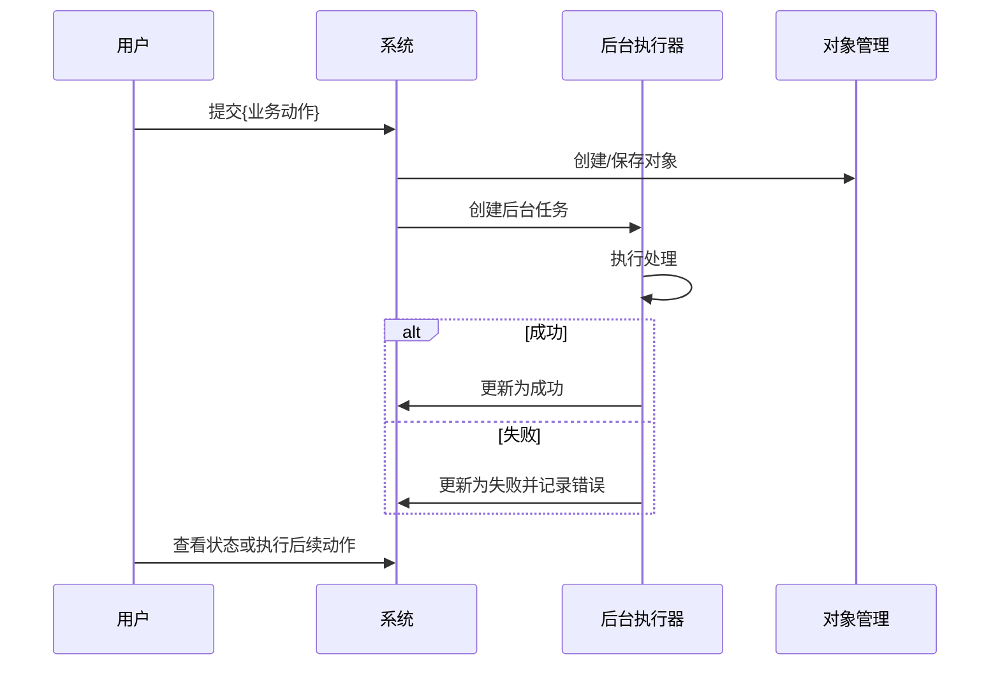

# {产品/应用名称} 研发版 PRD 参考模板

## 文档信息

| 项目 | 内容 |
| --- | --- |
| 产品名称 | {产品/应用名称} |
| 产品形态 | {Web 应用/平台模块/独立工具/后台服务/其他} |
| 更新时间 | {YYYY-MM-DD HH:mm:ss} |、

## 交付目标

本版本交付 {一句话描述本期要完成的产品闭环}。

完成定义：

1. {核心用户} 可以完成 {核心业务动作 1}、{核心业务动作 2}、{核心业务动作 3}。
2. 系统完成 {关键后端处理链路}，并能输出明确的成功、失败和异常分支结果。
3. {管理角色/运营角色} 可以完成 {管理能力/配置能力/监测能力}。
4. `AC-001` 至 `AC-XXX` 全部通过。
5. 不允许用静态假数据、跳过状态迁移或绕过关键数据写入来满足验收。

## 非目标

- 不实现 {明确排除能力 1}。
- 不接入 {明确排除系统/平台/外部依赖}。
- 不支持 {明确排除用户角色/使用方式/业务场景}。
- 不处理 {明确排除数据范围/文件范围/边界内容}。
- 不提供 {增强能力/生产级能力/运营能力}。

## 实现优先级与完成定义

1. 完成判断以 `验收标准` 为准。
2. 端到端行为以 `可执行业务流程` 为准。
3. 状态迁移以 `状态机` 为准。
4. 持久化结构以 `核心数据模型` 为准。
5. 用户可见名称、代码标识、状态、事件和命令以 `命名与文案真源` 为准。
6. 页面范围以 `页面与交互` 为准。
7. 测试数据以 `测试数据` 为准。
8. 实现顺序按 `开发切片顺序` 执行。
9. 未完成本期验收标准前，不实现范围外增强能力。

## 角色与权限

| 角色 | 允许能力 | 不允许能力 |
| --- | --- | --- |
| {角色 1} | {允许能力清单} | {禁止能力清单} |
| {角色 2} | {允许能力清单} | {禁止能力清单} |

## 命名与文案真源

本节是 AI Coding 的命名单一事实源。用户可见名称、代码标识、状态值、事件名、命令名、页面名和按钮名必须以本节为准，后续章节不得自行创造同义名称。

| 类型 | 标准名称 | 代码标识 | 使用位置 | 禁止别名 | 说明 |
| --- | --- | --- | --- | --- | --- |
| 应用名称 | {用户可见应用名称} | `{app_code}` | 菜单、页面标题、审计目标 | {禁止使用的历史名称/简称} | 用户可见应用名称必须统一 |
| 菜单名称 | {菜单名称} | `{menu.code}` | {所属端/导航位置} | {禁止别名} | 菜单名称不加"页" |
| 页面名称 | {页面名称} | `{PageComponentName}` | 页面与交互、路由 | {禁止别名} | 页面名称可以加"页" |
| 操作按钮 | {按钮文案} | `{commandName}` | 页面操作区、流程命令 | {禁止别名} | 按钮文案使用动词短语 |
| 角色 | {角色名称} | `{role_code}` | 角色权限、流程 Actor、权限测试 | {禁止别名} | 用户角色和权限判断必须使用同一代码标识 |
| 状态 | {状态名称} | `{status_code}` | 状态机、列表、详情、验收标准 | {禁止别名} | 状态值不得在代码中另起同义枚举 |
| 命令 | {命令名称} | `{commandName(params)}` | 可执行业务流程、接口/service、验收标准 | {禁止别名} | 命令名必须能追踪到 FLOW |
| 审计事件 | {事件名称} | `{event_name}` | 审计事件、流程 Events、验收标准 | {禁止别名} | 事件名必须使用稳定 snake_case |
| 数据模型 | {模型名称} | `{ModelName}` | 核心数据模型、状态机、断言对象 | {禁止别名} | 模型名称必须与实现结构一致 |
| 错误提示 | {用户可见错误提示} | `{ERROR_CODE}` | 错误分支、页面交互、验收标准 | {禁止别名} | 用户可见文案和错误码必须同时登记 |

命名约束：

1. 页面、流程、状态机、数据模型、审计事件、验收标准不得自行创造同义名称。
2. 用户可见名称和代码标识不一致时，必须同时在本节登记。
3. 菜单名称不加"页"；页面名称可加"页"；按钮名称必须使用动词短语。
4. 新增名称前必须先更新本节，再在后续章节引用。
5. `禁止别名` 中的名称不得出现在实现、测试、页面文案或审计事件中。

## 领域规则

### {核心规则组 1}

{说明该规则组的业务含义、输入、输出和边界。}

| 规则项 | 说明 |
| --- | --- |
| {规则项 1} | {规则说明} |
| {规则项 2} | {规则说明} |

### {核心规则组 2}

{说明该规则组的业务含义、输入、输出和边界。}

## 文件、数据或对象范围

| 范围项 | 本期支持 | 本期不支持 | 说明 |
| --- | --- | --- | --- |
| {对象/文件/数据类型 1} | {支持范围} | {不支持范围} | {边界说明} |
| {对象/文件/数据类型 2} | {支持范围} | {不支持范围} | {边界说明} |

## 存储与保留

本节只定义文件对象、业务对象和记录的生命周期，不限定具体存储实现，具体技术方案由研发决定。

| 对象 | 创建时机 | 保留规则 | 删除/清理规则 | 删除后影响 |
| --- | --- | --- | --- | --- |
| {对象 1} | {创建时机} | {保留规则} | {删除/清理规则} | {删除后影响} |
| {对象 2} | {创建时机} | {保留规则} | {删除/清理规则} | {删除后影响} |

## 可执行业务流程

本节定义端到端流程契约。实现时必须同时完成数据写入、状态迁移、对象变化和审计事件，不得只实现页面跳转。

### FLOW-001 {流程名称}

| 项 | 内容 |
| --- | --- |
| Actor | {执行角色} |
| Preconditions | {前置条件} |
| Command | `{commandName(params)}` |
| State Writes | {状态写入、对象创建、字段更新} |
| Events | `{event_name_1}`、`{event_name_2}` |
| Success UI | {成功后的页面反馈} |
| Error Branches | {错误分支和提示} |
| Acceptance | `AC-001`、`AC-002` |

### FLOW-002 {流程名称}

| 项 | 内容 |
| --- | --- |
| Actor | {执行角色/后台执行器} |
| Preconditions | {前置条件} |
| Command | `{commandName(params)}` |
| State Writes | {状态写入、对象变化、失败状态} |
| Events | `{event_name}` |
| Success UI | {成功后的页面反馈} |
| Error Branches | {错误分支和提示} |
| Acceptance | `AC-XXX` |

## 页面与交互

### {页面/入口名称 1}

入口：`{菜单/入口路径}`

展示内容：

- {字段/区域/控件 1}
- {字段/区域/控件 2}
- {字段/区域/控件 3}

可执行操作：

- {操作 1}
- {操作 2}

交互规则：

- {交互规则 1}
- {交互规则 2}

### {页面/入口名称 2}

入口：`{菜单/入口路径}`

展示内容：

- {字段/区域/控件 1}
- {字段/区域/控件 2}

可执行操作：

- {操作 1}

## 状态机

### {对象 1} 状态

| 状态 | 含义 | 可进入来源 | 可流转到 | 触发动作 |
| --- | --- | --- | --- | --- |
| `{status_1}` | {状态含义} | {来源状态} | {目标状态} | {触发动作} |
| `{status_2}` | {状态含义} | {来源状态} | {目标状态} | {触发动作} |

### {对象 2} 状态

| 状态 | 含义 | 可进入来源 | 可流转到 | 触发动作 |
| --- | --- | --- | --- | --- |
| `{status_1}` | {状态含义} | {来源状态} | {目标状态} | {触发动作} |

## 后台执行

执行规则：

- {后台任务触发方式，例如：用户提交后进入队列/定时任务扫描/状态轮询。}
- {并发规则，例如：每个用户 1 个并发/每个任务串行/全局并发上限。}
- {失败隔离规则，例如：单个对象失败不影响同批后续对象。}
- {重试规则，例如：失败后允许重试/不可重试/自动重试次数。}
- {超时和资源限制规则。}

## 核心数据模型

### {ModelName1}

| 字段 | 类型 | 说明 | 约束 |
| --- | --- | --- | --- |
| `id` | string | 主键 ID | 必填、唯一 |
| `{field}` | {type} | {说明} | {约束} |

### {ModelName2}

| 字段 | 类型 | 说明 | 约束 |
| --- | --- | --- | --- |
| `id` | string | 主键 ID | 必填、唯一 |
| `{field}` | {type} | {说明} | {约束} |

## 审计事件

至少记录：

- `{event_create}`
- `{event_update}`
- `{event_delete}`
- `{event_process_start}`
- `{event_process_success}`
- `{event_process_failed}`

审计事件不得记录 {敏感信息类型/原文片段/文件内容/密钥/凭证}。

| 字段 | 说明 |
| --- | --- |
| `id` | 审计事件 ID |
| `event_type` | 事件类型 |
| `actor_user_id` | 操作者 |
| `target_type` | 目标对象类型 |
| `target_id` | 目标对象 ID |
| `result` | `success`、`failed` |
| `error_message` | 失败说明 |
| `created_at` | 事件时间 |
| `metadata` | 不包含敏感原文的结构化元数据 |

## 结果产物

规则：

- {成功后生成什么结果。}
- {结果命名规则。}
- {结果可下载/可查看/可导出的条件。}
- {结果过期、删除或失败时的处理。}
- {结果操作是否记录审计事件。}

## 测试数据

本节定义验收标准可引用的固定测试数据。验收标准中的 `测试数据` 列必须引用本节 ID 或 fixture 名称，不得临时用自然语言另造样例。

| ID | 名称 | 用途 | 数据要求 |
| --- | --- | --- | --- |
| TD-001 | `{fixture_valid_success}` | 验证核心成功流程 | 覆盖 {核心对象/文件/输入} 的合法输入，能触发成功分支 |
| TD-002 | `{fixture_invalid_input}` | 验证输入校验和错误分支 | 覆盖空值、非法格式、数量超限、权限不足等错误输入 |
| TD-003 | `{fixture_permission_boundary}` | 验证权限隔离 | 至少包含两个用户/角色及各自对象，能触发跨用户或跨角色访问场景 |
| TD-004 | `{fixture_state_transition}` | 验证状态迁移 | 覆盖主要状态、异常状态和不可逆状态 |
| TD-005 | `{fixture_audit_events}` | 验证审计事件 | 覆盖创建、更新、处理成功、处理失败、删除或清理等关键事件 |

## 验收标准

| ID | 验收项 | 覆盖流程 | 测试类型 | 断言对象 | 测试数据 | 标准 |
| --- | --- | --- | --- | --- | --- | --- |
| AC-001 | {验收项 1} | `FLOW-001` | `e2e` | {状态、对象变化、页面反馈、审计事件} | `TD-001` | {可执行、可测试的验收标准} |
| AC-002 | {验收项 2} | `FLOW-001` | `integration` | {输入校验、错误提示、对象未创建} | `TD-002` | {可执行、可测试的验收标准} |
| AC-003 | 权限隔离 | `FLOW-XXX` | `permission` | {查询结果、操作入口、接口返回、错误码} | `TD-003` | {不同角色或用户只能访问和操作被授权对象} |
| AC-004 | 状态迁移 | `FLOW-XXX` | `state-machine` | {状态值、迁移副作用、禁止迁移} | `TD-004` | {状态只能按状态机定义迁移，非法迁移必须被阻断} |
| AC-005 | 审计事件 | `FLOW-001` 至 `FLOW-XXX` | `integration` | {事件类型、操作者、目标对象、结果、元数据} | `TD-005` | {关键动作均写入审计事件，审计事件不包含敏感原文或禁止暴露内容} |
| AC-006 | 可执行流程覆盖 | `FLOW-001` 至 `FLOW-XXX` | `e2e` | {关键状态、对象变化、审计事件、错误分支} | `TD-001`、`TD-002`、`TD-003` | `FLOW-001` 至 `FLOW-XXX` 至少有端到端测试或集成测试覆盖 |

## 实现约束

- 先完成 `FLOW-001` 至 `FLOW-XXX` 的端到端闭环，再处理范围外增强能力。
- 不允许用静态假数据绕过命令、状态、对象和审计事件写入。
- 状态、对象变化、审计事件必须可通过自动化测试验证。
- 错误说明、处理日志、审计事件不得包含敏感原文或不应暴露的内部细节。
- UI 文案以目标用户可理解为准，不暴露不必要的内部技术名词。
- 具体技术选型由研发决定；PRD 只约束业务行为、状态、数据边界和验收结果。

## 开发切片顺序

| 切片 | 目标 | 完成标准 |
| --- | --- | --- |
| Slice 1 | {基础框架/角色/入口} | {可进入页面或完成基础初始化} |
| Slice 2 | {核心对象创建} | {可创建核心对象并写入状态} |
| Slice 3 | {核心处理链路} | {可完成主要流程成功分支} |
| Slice 4 | {异常分支与重试} | {失败、重试、取消、删除等分支闭合} |
| Slice 5 | {管理/配置/监测能力} | {管理侧能力可用} |
| Slice 6 | {审计与自动化验收} | {关键事件和验收标准通过自动化测试覆盖} |

